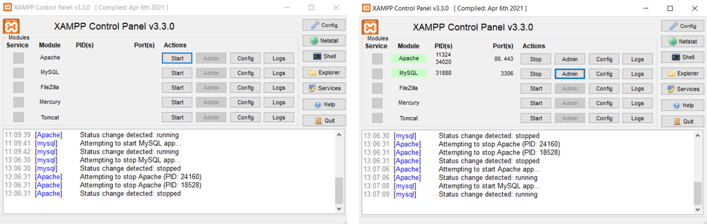
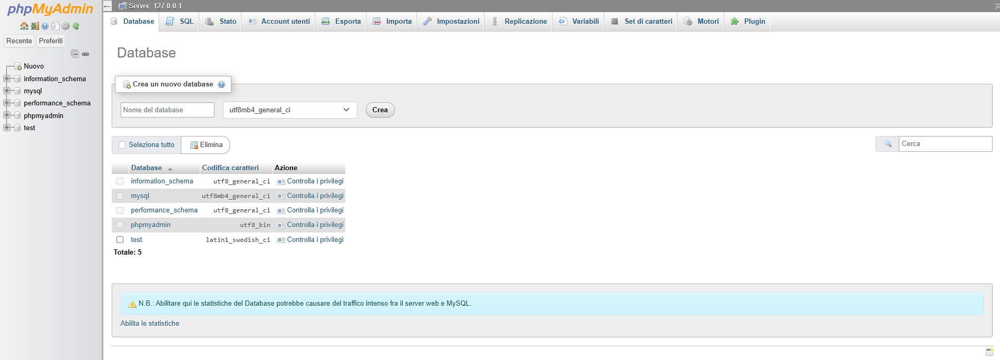
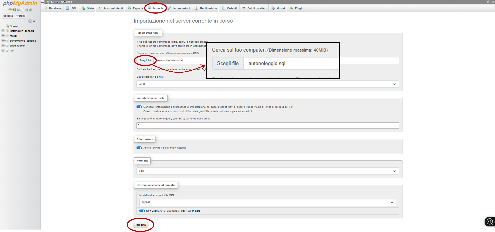
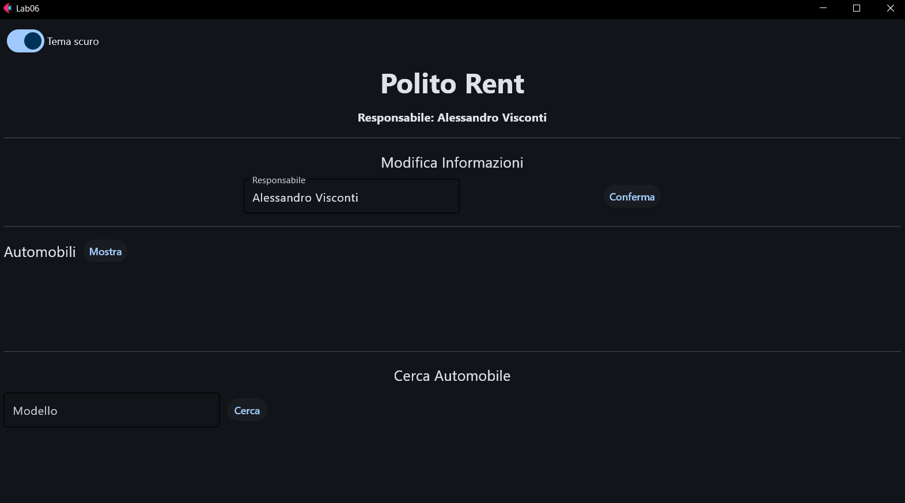

# Lab 06

#### Argomenti

- Utilizzo pacchetto `Flet` di Python (suggerita v0.28.3)
- Utilizzo Pattern MVC
- Utilizzo dei Package
- Utilizzo di mysql-connector-python (suggerita v9.5.0)

---
> **❗ ATTENZIONE:** 
>  Ricordare di effettuare il **fork** del repository principale, quindi clonare su PyCharm il **repository personale** 
> (https://github.com/my-github-username/Lab06) e non quello principale.
> 
> In caso di dubbi consultare la guida caricata nel lab02: 
> https://github.com/Programmazione-Avanzata-2025-26/Lab02/blob/main/Guida.pdf
> 

### Setup del Database tramite XAMPP
1. Installare `mysql-connector-python` (v9.5.0)
   - Lanciando, dal terminale di PyCharm il comando: `$ pip install mysql-connector-python` 
   - Oppure usando la GUI di PyCharm e le funzionalità di installazione package:

     `File →  Settings → Python → Interpreter → + → Cercare "mysql-connector-python" → Install Package`
2. Per utilizzare il database è necessario installare, se non già fatto, 
[`XAMPP`](https://www.apachefriends.org/it/download.html) (v8.2.12), quindi eseguire `Apache` e `MySQL`cliccando 
sui corrispettivi `Start` (vedi figura sottostante a sinistra).
3. Successivamente cliccare il pulsante `Admin` affianco a `MySQL` (vedi figura sottostante a destra) per accedere a `phpMyAdmin`, un’interfaccia web 
per gestire il database.

    

4. Dopo aver cliccato su `Admin` si aprirà `phpMyAdmin` sul browser come mostrato nella figura sottostante. 

    

5. Nella barra di navigazione in alto andare su `Importa`, quindi cliccare su `Scegli File` e selezionare il file 
`autonoleggio.sql` fornito nel git, quindi cliccare su `Importa` in basso alla pagina per importare il database.

    

6. A questo punto il database sarà pronto per l'utilizzo.

---

## Autonoleggio - MVC e Database
Implementare un’applicazione per la gestione di un autonoleggio (già visto nel Lab03 e Lab05). 
L’applicazione deve consentire di:
- Visualizzare le automobili presenti nell’autonoleggio;
- Ricercare tutte le automobili di un certo modello. 

Prestare attenzione alla gestione di tutte le possibili condizioni di errore. Fare uso del pattern MVC, 
utilizzando i pacchetti `flet` e `mysql-connector-python`, come spiegato a lezione.

### Implementazione
Realizzare un’interfaccia grafica con `flet` simile a quella mostrata in figura. 



La proposta di interfaccia include:
- Titolo pagina (“Lab06”) – già fatto ✅
- Pulsante per cambiare tema (default dark mode) utilizzando `Switch` – già fatto ✅ 
- **Sezione 1**: Intestazione Autonoleggio - già fatto ✅
  - Un controllo `Text` con il nome dell'autonoleggio.
  - Un controllo `Text` con il nome del responsabile.
- **Sezione 2**: Modificare il nome del responsabile - già fatto ✅
  - Un controllo `Text` con testo “Modifica Informazioni”. 
  - Un controllo `TextField` per modificare il nome. 
  - Un controllo `ElevatedButton` “Conferma” per confermare la modifica.
- **Sezione 3**: Lista delle Automobili - TODO 📝
  - Un controllo `Text` con testo “Automobili”. 
  - Un controllo `ElevatedButton` “Mostra” per mostrare tutte le automobili presenti nel database. 
  - Un contenitore `ListView` da popolare con le auto che vengono lette dal database. 
- **Sezione 4**: Ricerca automobile per modello - TODO 📝
  - Un controllo `Text` con testo “Cerca Automobile”. 
  - Un controllo `TextField` per inserire il modello dell’automobile da cercare.
  - Un controllo `ElevatedButton` “Cerca” per avviare la ricerca. 
  - Un contenitore `ListView` da popolare con l’elenco delle automobili trovate nel database dato il modello inserito 
  (nel database possono esserci più automobili dello stesso modello). 

---

## Materiale Fornito
Il repository del lab06 è organizzato con la struttura ad albero mostrata di seguito e contiene tutto il necessario per 
svolgere il laboratorio:

```code
Lab06/
├── database/
│   ├── __init__.py
│   ├── connector.cnf
│   └── DB_connect.py
│
├── model/
│   ├── __init__.py
│   ├── automobile.py
│   ├── model.py (DA MODIFICARE)
│   └── noleggio.py
│
├── UI/
│   ├── __init__.py
│   ├── alert.py
│   ├── controller.py (DA MODIFICARE)
│   └── view.py (DA MODIFICARE)
│
├── __init__.py
├── autonoleggio.sql (DA IMPORTARE SU phpMyAdmin)
└── main.py (DA ESEGUIRE)
 ```

- Il file `autonoleggio.sql` da importare su `phpMyAdmin` per creare e popolare il database.
- Il file `main.py` da eseguire per far partire l’applicazione.
- Il package **_database_** contiene il file `DB_connect.py` che effettua la connessione con il database (nel file `connector.cnf` sono contenute le info 
  necessarie per effettuare la connessione al database).
- Il package **_model_** contiene i file che implementano il modello, ovvero la struttura dati rappresentata dalla classe 
`Autonoleggio` (`model.py`), insieme alle classi `Automobile` (`automobile.py`) e `Noleggio` (`noleggio.py`), 
che ne costituiscono e supportano il funzionamento.
- Il package **_UI_** contiene: il file `view.py` che definisce la classe `View`, che implementa l’interfaccia grafica 
utilizzando `flet` e il file `controller.py` contenente la classe `Controller` che funge da intermediario tra la View 
e il Modello. Inoltre, qui è presente il file `alert.py` in cui è definita la classe `AlertManager` usata per mostrare 
gli alert mediante il metodo `show_alert()`. 
